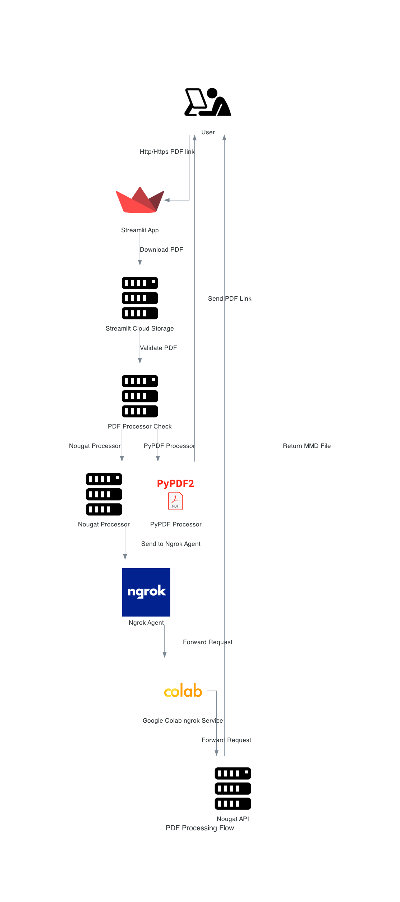
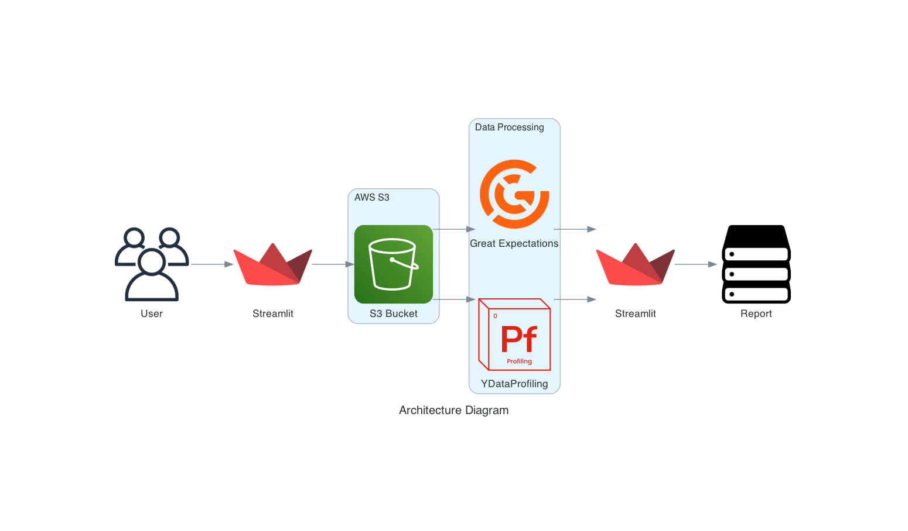

# Assignment1

## Abstract 📝
Two Streamlit applications have been developed one that processes PDFs either via Nougat or PyPDF python libraries. The objective of is to analyze and compare Nougat and PyPDF based on various use cases and different input PDFs. Another application allows users to evaluate the quality of the Freddie Mac Single Family dataset. Users can upload a CSV or XLS file containing either Origination or Monthly performance data and assess whether it adheres to the published schema. The tool will use ydata profiling to summarize the data and display the results to the user. Additionally, it will run Great Expectations to perform data quality checks, including schema validation, data validity, absence of missing data, and other custom tests.


## Team Members 👥
- Aditya Kawale
  - NUID 002766716
  - Email kawale.a@northeastern.edu
- Nidhi Singh
  - NUID 002925684
  - Email singh.nidhi1@northeastern.edu
- Uddhav Zambare
  - NUID 002199488
  - Email zambare.u@northeastern.edu

---

## Project Structure
```text
Part1
├── NougatAPIServer.ipynb
├── README.md
├── architecture_diagram_generator.py
├── images
│   ├── colab.png
│   ├── ngrok.png
│   ├── pypdf2.png
│   ├── streamlit.png
│   └── user.png
├── main.py
├── pages
│   └── architecture.py
├── pdf_processing_flow.png
└── requirements.txt
```

```text
Part2
├── Home.py
├── README.md
├── arch_diagram.py
├── architecture_diagram.png
├── aws_config.py
├── data
│   ├── file_layout.xlsx
│   ├── monthly
│   └── origination
├── example.env
├── gx
│   ├── expectations
│   ├── great_expectations.yml
│   └── uncommitted
├── gx_monthly_data.py
├── gx_origination_data.py
├── images
│   ├── great_expectations.png
│   ├── streamlit.png
│   └── ydata-profiling.png
├── pages
│   ├── Architecture.py
│   ├── Great_Expectation.py
│   └── Test.py
└── requirements.txt
```


### Links 📎
* 📕 Codelab Doc - [link](https://codelabs-preview.appspot.com/?file_id=1Cz1a014Ubldm9KmCfepl4YgiDrpXliy61-8hpURtaU0#1)
* 1️⃣ Streamlit Application for PDF Processing via NougatOCR and PyPDF2 - [link](https://team7-a1-part1.streamlit.app/)
* ❷ Streamlit Application for Data Profiling / Validation using ydata-profiling and great-expectations - [link](https://team7-a1-part2.streamlit.app/)
* 📕 Colab Notebook - [link](https://colab.research.google.com/drive/19ZC0VftwrLqhjoKbIJdi6v5L5Tf82K7X?usp=sharing)
* 📊 Part 1 Datasets (SEC.gov) - [link](https://www.sec.gov/forms)
* 📊 Part 2 Datasets (Freddie Mac) - [link](https://colab.research.google.com/drive/19ZC0VftwrLqhjoKbIJdi6v5L5Tf82K7X?usp=sharing)
* 🗑️ Part 1 Outputs (processed ouputs) - [link](https://drive.google.com/drive/folders/1M58SePulCkmJjF0tWH5A8e7J-1QfAcRS?usp=sharing)

### Tools 🧰
* 🔧 Streamlit - [link](https://streamlit.io/)
* 🔧 NougatOCR - [link](https://github.com/facebookresearch/nougat)
* 🔧 PyPDF2 - [link](https://pypdf2.readthedocs.io/en/3.0.0/)
* 🔧 Google Colab - [link](https://colab.research.google.com/)
* 🔧 AWS s3 - [link](https://aws.amazon.com/s3/)
* 🔧 ydata-profiling - [link](https://docs.profiling.ydata.ai/4.5/)
* 🔧 great-expectations - [link](https://docs.greatexpectations.io/docs/)

## Part 1 - PDF Processing

### Architecture 👷🏻‍♂️



Flow for Part 1

1. User gives Http/Https PDF link to Streamlit App hosted on Streamlit Cloud
2. Streamlit cloud app downloads the pdf on its own storage and validates if it is truly a pdf file
3. If the check passes, it checks the PDF Processor.
4. If the PDF Processor is PyPDF it processes the PDF on Streamlit Cloud itself
5. If the PDF Processor is Nougat it sends the downloaded PDF to Ngrok Agent which is accessible via public internet
6. Once the Ngrok Agent gets the request, it forwards it to Google Colab ngrok service
7. Ngrok service forwards the request to Nougat API running on port 8503
8. Nougat API processes the PDF and returns the MMD file via HTTP to streamlit application
9. User downloads MMD files from Streamlit


---

### Source Code References 💻

1. (Front-end) **streamlit-pdf-processing** - [link](https://github.com/BigDataIA-Fall2023-Team7/Assignment1-PDF-Processing-Application/tree/main/Part1)
2. (Back-end) **colab-nougat-api-server** - [link](https://github.com/BigDataIA-Fall2023-Team7/Assignment1-PDF-Processing-Application/blob/main/Part1/NougatAPIServer.ipynb)


---

### Observations and Challenges

- NougatOCR has 2 offerings CLI and API. The CLI version is mature with many configuration options as opposed to API version. We used API version specifically as we are trying to build a cloud application with decoupled front-end and back-end
- As per our experiments,
   - NougatOCR takes 6.30 minutes to generate MMD file for single page PDF when used with Colab CPU
   - NougatOCR takes 1.30 minutes to generate MMD file for single page PDF when used with Colab TPU
   - NougatOCR library uses caching mechanism on individual page level, so if the output is requested for the same file in next iterations, the responses are quick.
   - NougatOCR API returns the processed output in string format which needs preprocessing before converting it to MMD file
      - Example:
      -  Remove the first and last double quotations
      -  Replace \n with literal newline character
      -  Replace \\\ with \


### Pros and Cons
- *Equations*: Nougat is better than PyPDF. Nougat properly represents equations with correct symbols and presentation (subscript/superscript). PyPDF fails at capturing symbols and doesnot maintain presentation elements.

- *Tables*: Nougat is better at judging tables than PyPDF

- *Header, Footer, Font styles*: PyPDF is better at capturing header and footer information but fails at capturing font styles

- *Text inside images*: Since nougat does OCR, it is able to extract textual elements from images. PyPDF fails here

- *Hyperlinks*: Nougat needs https or http infront of URLs to treat them as hyperlinks in MMD files


---
## Part 2

### Objective
The objective of this module is to build a tool that allows users to evaluate the quality of the Freddie Mac Single Family dataset. Users can upload a CSV or XLS file containing either Origination or Monthly performance data and assess whether it adheres to the published schema. The tool will use Pandas Profiling to summarize the data and display the results to the user. Additionally, it will run Great Expectations to perform data quality checks, including schema validation, data validity, absence of missing data, and other custom tests.


### Architecture



**Streamlit:** Streamlit provides an easy-to-use web interface for uploading files and displaying reports. It simplifies the development of the user interface.

**Pandas Profiling:** Pandas Profiling is a powerful tool for data profiling, generating summary statistics, and visualizations of the dataset. It helps users quickly understand the data.

**Great Expectations:** Great Expectations is a robust framework for data validation. It allows us to define and enforce expectations about the dataset's schema and data quality.

**AWS S3:** AWS S3 is used for temporary file storage. Uploaded files are stored here before analysis. This ensures that the original dataset is not modified.


### Input Data Format Constraints

The input data must adhere to the following constraints:

- Data must follow the schema provided and should not have columns names. The data must be in the same format as it is on the [website](https://www.freddiemac.com/research/datasets/sf-loanlevel-dataset)
- The data columns must follow the same order as mentioned in the [`file_layout.xlsx`](https://www.freddiemac.com/fmac-resources/research/pdf/file_layout.xlsx) file available on the Freddie Mac Loan Set website.

### Steps to Execute
App can be directly accessed from Streamlit Cloud via [link](https://team7-a1-part2.streamlit.app/)

*OR*

1. Clone the [repository](https://github.com/BigDataIA-Fall2023-Team7/Assignment1-PDF-Processing-Application.git) to your local machine:
   ```
   git clone <repository_url>
   ```

2. Navigate to the module directory:
   ```
   cd Part2
   ```

3. Create a virtual environment and activate it:
   ```
   python -m venv venv
   source venv/bin/activate  # On Windows, use: venv\Scripts\activate
   ```

4. Install the required dependencies from the `requirements.txt` file:
   ```
   pip install -r requirements.txt
   ```

5. Create a `.env` file with the necessary environment variables, such as AWS credentials. Reference: [example.env](Part2/example.env)

6. Run the Streamlit application:
   ```
   streamlit run Home.py
   ```

7. Access the tool through your web browser at `http://localhost:8501`.

### Scope
By using this tool, we aim to simplify the process of evaluating the quality of Freddie Mac Single Family dataset files. The tool leverages the power of Pandas Profiling and Great Expectations to provide comprehensive data analysis and validation reports to ensure data quality and adherence to the schema. This project will help data engineers and analysts assess and trust the data they work with, ultimately improving data-driven decision-making processes.

If you encounter any issues or have suggestions for improvements, please feel free to open an issue or contribute to this project. Your feedback is valuable in enhancing the tool's functionality and usability.

## Contribution 🤝
*   Aditya : 34`%` 
*   Nidhi : 33`%`
*   Uddhav : 33`%`

## Individual Distribution ⚖️

| **Developer** 	|          **Deliverables**          	|
|:-------------:	|:----------------------------------:	|
|      Aditya      	| Streamlit Part 1 - Nougat             |
|      Aditya      	| Git setup and integration             |
|      Uddhav      	| Streamlit Part 2 - Great Expectation  |
|      Uddhav      	| Streamlit Part 2 - Ydata Profiling    |
|      Nidhi      	| Streamlit Part 1 - Pypdf          	|
|      Nidhi      	| Architecture Diagrams                 |
|      Nidhi      	| Documentation                         |

---
---

> WE ATTEST THAT WE HAVEN’T USED ANY OTHER STUDENTS’ WORK IN OUR ASSIGNMENT AND ABIDE BY THE POLICIES LISTED IN THE STUDENT HANDBOOK.
