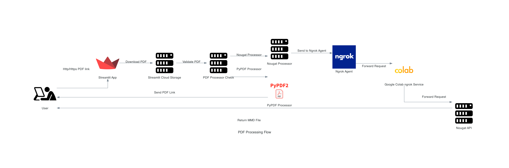
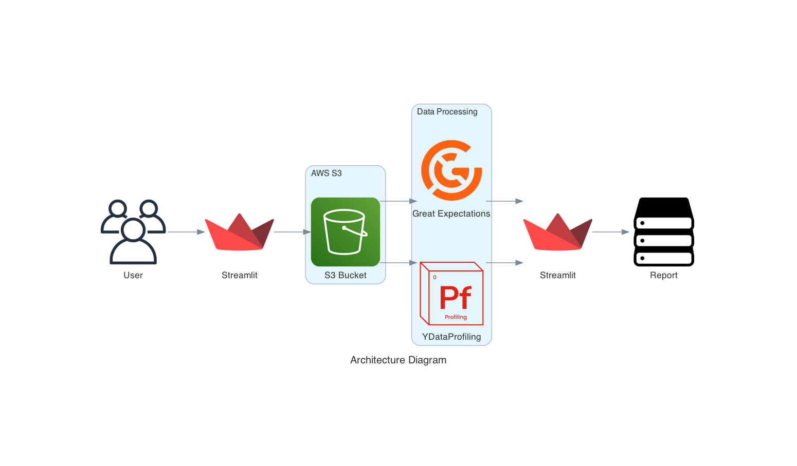

# Assignment1

## Abstract 📝
Two Streamlit applications have been developed one that processes PDFs either via Nougat or PyPDF python libraries. The objective of is to analyze and compare Nougat and PyPDF based on various use cases and different input PDFs. Another application allows users to evaluate the quality of the Freddie Mac Single Family dataset. Users can upload a CSV or XLS file containing either Origination or Monthly performance data and assess whether it adheres to the published schema. The tool will use Pandas Profiling to summarize the data and display the results to the user. Additionally, it will run Great Expectations to perform data quality checks, including schema validation, data validity, absence of missing data, and other custom tests.


## Team Members 👥
- Aditya Kawale
  - NUID 00276616
  - Email kawale.a@northeastern.edu
- Nidhi Singh
  - NUID 002925684
  - Email singh.nidhi1@northeastern.edu
- Uddhav Zambare
  - NUID 0029199488
  - Email zambare.u@northeastern.edu

---

## Part 1 - PDF Processing

### Links 📎
* 📕 Codelab Doc - [link](https://codelabs-preview.appspot.com/?file_id=)
* 📊 Streamlit Application for PDF Processing - [link]()
* 📊 Streamlit Application for Data Profiling - [link]()
* 📕 Colab Notebook - [link]()
* 📊 Input Data - [link](https://www.sec.gov/forms)
* 📊 Output Data - [link]()
* 🔧 Tools Used - [link]()

---
### Architecture 👷🏻‍♂️



1. User gives Http/Https PDF link to Streamlit App on Streamlit Cloud
2. Streamlit Cloud App downloads the pdf on its own storage and validates if it is truly a pdf file
3. If the check passes, it checks the PDF Processor.
4. If the PDF Processor is PyPDF it processes the PDF on Streamlit Cloud itself
5. If the PDF Processor is Nougat it sends the downloaded PDF to Ngrok Agent which is accessible via public internet
6. Once the Ngrok Agent gets the request, it forwards it to Google Colab ngrok service
7. Ngrok service forwards the request to Nougat API running on port 8503
8. Nougat API processes the PDF and returns the MMD file via HTTP to streamlit application
9. User downloads MMD files from Streamlit


---

### Source Code References 💻

1. Branch: **streamlit-pdf-processing** - [link](https://github.com/BigDataIA-Fall2023-Team7/Assignment1-PDF-Processing-Application/tree/main/Part1)

---

### Observations
1. Nougat
OCR (Optical Character Recognition): Nougat includes built-in OCR capabilities, which means it can extract text from scanned PDFs or images, making it suitable for handling non-text-based PDFs.

Advanced Text Extraction: It provides more advanced text extraction features, such as the ability to extract text from specific regions or layouts within a PDF.

Layout Preservation: Nougat focuses on preserving the original layout and formatting of the extracted text, which is useful for applications where maintaining the visual integrity of the PDF is important.

2. Pypdf
OCR Support: PyPDF2 does not include built-in OCR support; you would need to use a separate OCR library or tool if you need to extract text from scanned PDFs.

Basic Text Extraction: PyPDF2 primarily focuses on basic text extraction from PDF documents. It may not handle scanned or image-based PDFs well without the aid of external OCR tools.

Layout Preservation: PyPDF2 may not preserve the original layout and formatting of text as accurately as Nougat, especially in complex PDFs.

---
## Part 2
### Links 📎
* 📕 Codelab Doc - [link](https://codelabs-preview.appspot.com/?file_id=)
* 📊 Streamlit Application for Data Profiling - [link]()
* 📊 Input Data - [link](https://www.freddiemac.com/research/datasets/sf-loanlevel-dataset)
* 🔧 Tools Used - [link]()

### Architecture 👷🏻‍♂️



### Source Code References 💻
1. Branch: **streamlit-great-expectations** - [link](https://github.com/BigDataIA-Fall2023-Team7/Assignment1-PDF-Processing-Application/tree/main/Part2)

### Steps to Execute
1. Clone the repository to your local machine:
   ```
   git clone <repository_url>
   ```

2. Navigate to the project directory:
   ```
   cd project-directory
   ```

3. Create a virtual environment and activate it:
   ```
   python -m venv venv
   source venv/bin/activate  # On Windows, use: venv\Scripts\activate
   ```

4. Install the required dependencies from the `requirements.txt` file:
   ```
   pip install -r requirements.txt
   ```

5. Create a `.env` file with the necessary environment variables, such as AWS credentials.

6. Run the Streamlit application:
   ```
   streamlit run app.py
   ```

7. Access the tool through your web browser at `http://localhost:8501`.


## Individual Contribution ⚖️

| **Developer** 	|          **Deliverables**          	|
|:-------------:	|:----------------------------------:	|
|      Aditya      	| Streamlit Part 1 - Nougat             |
|      Aditya      	| Git setup and integration             |
|      Nidhi      	| Streamlit Part 1 - Pypdf          	|
|      Uddhav      	| Streamlit Part 2 - Great Expectation  |
|      Uddhav      	| Streamlit Part 2 - Ydata Profiling    |
|      Nidhi      	| Architecture Diagrams                 |
|      Nidhi      	| Documentation                         |


## Undertaking 👮🏻‍♂️

> WE ATTEST THAT WE HAVEN’T USED ANY OTHER STUDENTS’ WORK IN OUR ASSIGNMENT AND ABIDE BY THE POLICIES LISTED IN THE STUDENT HANDBOOK

**Contribution**: 🤝
*   Aditya: 34`%`
*   Nidhi : 33`%`
*   Uddhav : 33`%`
